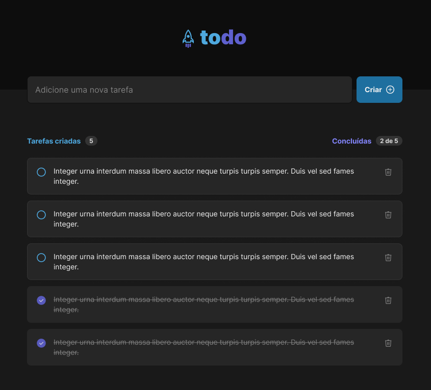

<h1 align="center">
  
</h1>

 

  

## 🚀 Ari - To Do List

Aplicação de controle de tarefas no estilo **to-do list**, que contém as seguintes funcionalidades:

- Adicionar uma nova tarefa
- Marcar e desmarcar uma tarefa como concluída
- Remover uma tarefa da listagem
- Mostrar o progresso de conclusão das tarefas

## 💻 Projeto

Essa é uma aplicação React utilizando TypeScript, Vite e Tailwind CSS para aprender sobre os conceitos importantes de React:

- Estados
- Imutabilidade do estado
- Listas e chaves no ReactJS
- Propriedades
- Componentização

## App online para testar

App online: [https://ari-to-do-list.pages.dev/](https://ari-to-do-list.pages.dev/).

## Layout

Você pode visualizar o layout do projeto através [desse link](https://www.figma.com/file/0n0zDN7zbzhRbaEO74Xesx/). É necessário ter conta no [Figma](http://figma.com/) para acessá-lo.

## Tecnologias

Esse projeto foi desenvolvido com as seguintes tecnologias:

- [React](https://react.dev/)
- [TypeScript](https://www.typescriptlang.org/)
- [Vite](https://vitejs.dev)
- [Tailwind CSS](https://tailwindcss.com/)

### Como executar

- Clone o repositório
- Rode a aplicação com `pnpm run dev`

Agora você pode acessar o link gerado pelo Vite no navegador.

## Licença

Esse projeto está sob a licença MIT. Veja o arquivo [LICENSE](LICENSE.md) para mais detalhes.
